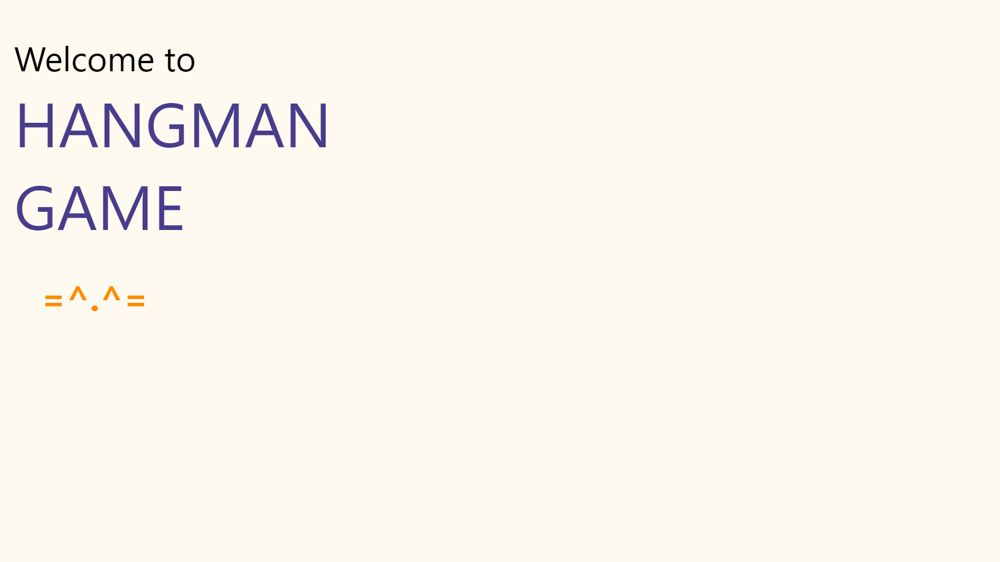

# Hangman Game

 

### Created with the guidance provided in the book [JavaScript for Kids](https://www.goodreads.com/book/show/18596230-javascript-for-kids) by Nick Morgan.

 

#### Additional features added:
* A common hint is provided to help the user guess the word
* No. of remaining guess is displayed to user at each guess prompt

 
  

